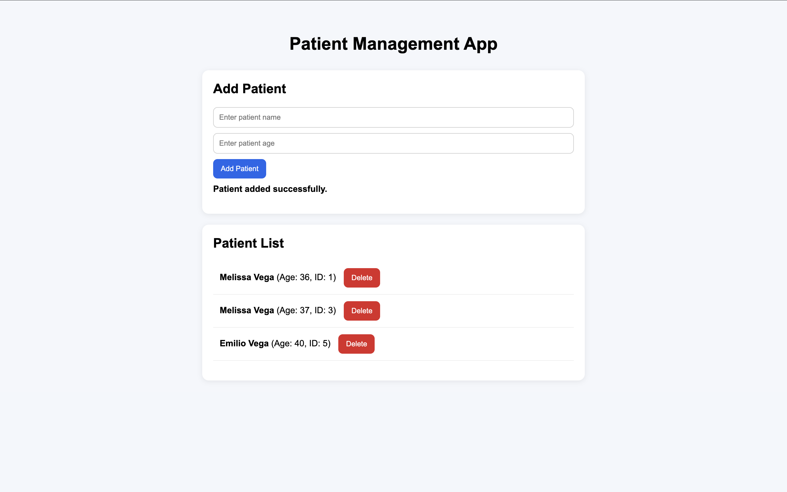

# FastAPI Patient API

## Description
This project is a beginner-friendly FastAPI application that simulates a simple patient database with full CRUD functionality. As a healthcare professional transitioning into tech, I wanted to build something that reflects real-world clinical workflows while learning backend development.

The goal of this project is to manage patient data in a structured way, similar to how electronic medical record (EMR) systems handle patient information.

## Features
- Create a new patient record
- View all patients
- View a single patient by ID
- Update patient information
- Delete a patient record

## Tech Stack
- Python
- FastAPI
- Uvicorn
- Pydantic (for data validation)

## Installation

Clone the repository:

```bash
git clone https://github.com/melvega888/fastapi-patient-api.git
cd fastapi-patient-api
```

Create and activate virtual environment, then install dependencies:

```bash
python -m venv venv
source venv/bin/activate   # Mac/Linux
pip install -r requirements.txt
```

Run the API server:

```bash
uvicorn main:app --reload
```

Open your browser and go to webpage:

http://127.0.0.1:8000/docs


## Preview


