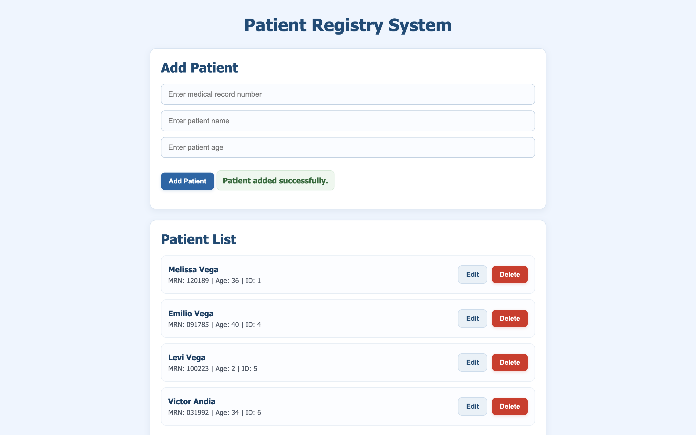

# Full-Stack Patient Management Application (FastAPI + JavaScript)

## Description
This project is a full-stack patient management application built using FastAPI, SQLite, HTML, CSS, and JavaScript. It simulates a simplified electronic medical record (EMR) system with full CRUD functionality.

As a healthcare professional transitioning into tech, I wanted to build something that reflects real-world clinical workflows while learning both backend and frontend development. This project focuses on managing patient data in a structured and user-friendly way.

---

## Features
- Create a new patient record
- View all patients in a dynamic UI
- View a single patient by ID (API)
- Update patient information (including MRN)
- Delete a patient record with confirmation
- Real-time UI updates using JavaScript (no page reload)

---

## Tech Stack
**Backend**
- Python
- FastAPI
- SQLite
- Pydantic

**Frontend**
- HTML
- CSS
- JavaScript (Fetch API)

**Other Tools**
- Uvicorn
- Git & GitHub

---

## Key Concepts Demonstrated
- REST API design (CRUD endpoints)
- Frontend ↔ Backend communication (Fetch API)
- CORS configuration
- State management (edit vs create mode)
- Data modeling using MRN vs internal database ID
- Dynamic UI rendering with JavaScript

---

## Installation

Clone the repository:

```bash
git clone https://github.com/melvega888/fastapi-patient-api.git
cd fastapi-patient-api
```

Create and activate virtual environment, then install dependencies:

```bash
python -m venv venv
source venv/bin/activate   # Mac/Linux
pip install -r requirements.txt
```

Run the API server:

```bash
uvicorn main:app --reload
```

In a separate terminal:

```bash
python3 -m http.server 5500
```

Open your browser and go to webpage(frontend):

http://127.0.0.1:5500/index.html

Open your browser and go to webpage(backend):

http://127.0.0.1:8000/docs


## Preview


  